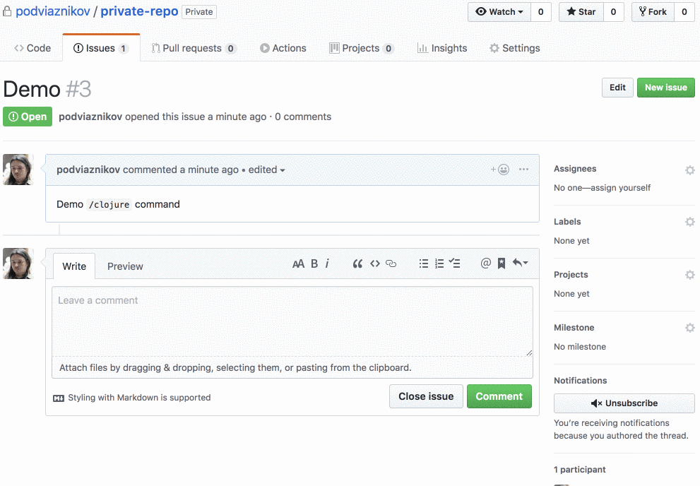

## GitHub Actions for Clojure REPL

### Usage

Create new issue comment and type `/clojure ` followed by any valid Clojure expression like
`clojure (+ 1 2 3)`.

After action is executed you will get new issue comment from the `actions` bot with message like this:

```clojure
(+ 1 2 3)
```
```
6
```


### Workflow

To include this action just add following code to your flow:

```
action "repetitive/actions/clojure" {
  uses = "repetitive/actions/clojure@master"
  secrets = ["GITHUB_TOKEN"]
}
```

### Demo

